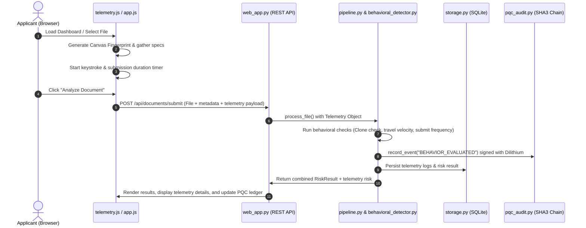

# Implementation Plan: Behavioral Analytics Layer for FraudSniffer

This plan details the architecture, data structures, backend models, client-side telemetry collectors, and dashboard panels needed to implement and integrate a robust, offline-resilient **Behavioral Analytics Layer** into FraudSniffer.

---

## 1. Goal Description

Currently, FraudSniffer operates strictly on **document-level features** (OCR text, document metadata, seals, and layout structural anomalies). However, coordinate fraud syndicates (e.g., bot farms, automated file-submitters, or identity thieves using device emulators) often submit documents using identical browser fingerprints, impossible travel locations, or script-automated speeds.

### Key Objectives:
1. **Client Telemetry Collection:** Capture client-side telemetry (browser specs, canvas fingerprint, system fonts, timezone, language, and network IP data) during file submission.
2. **Device & Fingerprint Profiling:** Calculate a unique hardware-based **Canvas Fingerprint Hash** to detect "device cloning" (e.g., 50 different document submissions using distinct names but sharing the exact same hardware rendering profile).
3. **Local Geographical & Network Inspection:** Stub offline-resilient VPN/Proxy checks and calculate "Impossible Travel" anomalies (e.g., an applicant logging in from Mumbai and then submitting another document 5 minutes later from London).
4. **Submission Dynamic Metrics:** Profile upload velocities (e.g., flagging scripted uploads where metadata input is typed, submitted, and completed in under 2 seconds).
5. **UI Explainability:** Add behavioral risk factors to the Explainability layer, including a dedicated telemetry inspector panel and PQC cryptographic event linkages.

---

## 2. Architecture & Ingress Flow



---

## 3. Database Schema Extensions

We will add two new SQLite tables in `storage.py` to persist telemetry data for cross-document anomaly detection:

### 1. `telemetry_logs`
Stores the raw hardware configuration and submission parameters of each upload session.
```sql
CREATE TABLE IF NOT EXISTS telemetry_logs (
    doc_id TEXT PRIMARY KEY,
    canvas_fingerprint TEXT NOT NULL,
    ip_address TEXT,
    timezone TEXT,
    language TEXT,
    screen_resolution TEXT,
    platform TEXT,
    vpn_detected INTEGER,
    proxy_detected INTEGER,
    tor_detected INTEGER,
    keystroke_duration_ms INTEGER,
    submission_duration_ms INTEGER,
    created_at REAL NOT NULL,
    FOREIGN KEY(doc_id) REFERENCES documents(doc_id)
);
```

### 2. `device_profiles`
Maintains tracking profiles for canvas fingerprints to detect duplicate device spikes.
```sql
CREATE TABLE IF NOT EXISTS device_profiles (
    canvas_fingerprint TEXT PRIMARY KEY,
    total_submissions INTEGER DEFAULT 1,
    last_ip TEXT,
    last_submission_time REAL,
    associated_doc_ids TEXT -- Comma-separated list of document IDs
);
```

---

## 4. Proposed Changes

### [NEW] `telemetry.js`
Path: [fraud_sniffer/fraudsniffer/static/telemetry.js](file:///c:/Users/Acer/Downloads/canara/fraud_sniffer/fraudsniffer/static/telemetry.js)

A lightweight client-side collection library to generate fingerprints and trace keystrokes.
- **Canvas Fingerprinting:** Draw a hidden 2D text string onto an HTML5 `<canvas>` element using a customized font styling. Retrieve the Base64 data URI of the rendered canvas and hash it (e.g. SHA-256) to produce a unique hardware-based device signature.
- **Keystroke Dynamics:** Measure keypress intervals (duration, latency) in form inputs to confirm organic typing vs. instant copy-pasting (script injection).
- **Timezone Cross-Validation:** Capture the local system timezone (`Intl.DateTimeFormat().resolvedOptions().timeZone`) and compare it against the claimed city timezone.

---

### [NEW] `behavioral_detector.py`
Path: [fraud_sniffer/fraudsniffer/behavioral_detector.py](file:///c:/Users/Acer/Downloads/canara/fraud_sniffer/fraudsniffer/behavioral_detector.py)

A python module containing behavioral check rules and calculations.

#### Core Algorithms:
1. **Impossible Travel Check:**
   - Input: Current IP address, Current timestamp, Past submissions from database.
   - Algorithm:
     - Geolocate both IPs (using local GeoIP database or fallback stub).
     - Calculate distance using Great-Circle distance formula:
       $$d = 2R \arcsin \left( \sqrt{\sin^2\left(\frac{\Delta\phi}{2}\right) + \cos\phi_1\cos\phi_2\sin^2\left(\frac{\Delta\lambda}{2}\right)} \right)$$
     - Compute required velocity: $v = \frac{d}{\Delta t}$.
     - If velocity $> 1000 \text{ km/h}$ (cruising speed of a commercial airliner), raise `IMPOSSIBLE_TRAVEL` risk.

2. **Device Cloning Check:**
   - Count how many unique document IDs are associated with the current `canvas_fingerprint` in the last 24 hours.
   - If count $> 3$, flag as `DEVICE_CLONE` (suspected emulator/bot farm).

3. **Submissions Velocity (Script Ingress):**
   - If `submission_duration_ms < 1000` (file submitted in under 1 second from form initialization), flag as `SCRIPTED_SUBMISSION`.

4. **Repeat Fraud Fingerprinting (Cluster Detection):**
   - Input: Current document details (employer_name, salary_amount, seal pHash, canvas_fingerprint).
   - Algorithm:
     - Query history for documents sharing the exact same `employer_name`, `salary_amount`, identical `canvas_fingerprint`, and a close `seal_phash` (Hamming distance <= 5).
     - If the number of matching historical submissions is >= 5, raise a `KNOWN_DEVICE_CLUSTER` or `REPEATED_PATTERN` risk alert.

---

### [MODIFY] `models.py`
Path: [fraud_sniffer/fraudsniffer/models.py](file:///c:/Users/Acer/Downloads/canara/fraud_sniffer/fraudsniffer/models.py)

- Add new behavioral risk reason codes to `ReasonCode`:
  ```python
  DEVICE_CLONE = "DEVICE_CLONE"
  IMPOSSIBLE_TRAVEL = "IMPOSSIBLE_TRAVEL"
  VPN_DETECTED = "VPN_DETECTED"
  SCRIPTED_SUBMISSION = "SCRIPTED_SUBMISSION"
  KNOWN_DEVICE_CLUSTER = "KNOWN_DEVICE_CLUSTER"
  REPEATED_PATTERN = "REPEATED_PATTERN"
  ```
- Add a `TelemetryData` dataclass representation.

---

### [MODIFY] `storage.py`
Path: [fraud_sniffer/fraudsniffer/storage.py](file:///c:/Users/Acer/Downloads/canara/fraud_sniffer/fraudsniffer/storage.py)

- Extend SQL schema initialization in `_init_db()` to create the `telemetry_logs` and `device_profiles` tables.
- Add `save_telemetry(doc_id, telemetry)` and `get_telemetry(doc_id)` query functions.
- Add history lookup `get_device_submission_count(fingerprint)` and `get_last_submission_by_ip(ip)`.

---

### [MODIFY] `pipeline.py`
Path: [fraud_sniffer/fraudsniffer/pipeline.py](file:///c:/Users/Acer/Downloads/canara/fraud_sniffer/fraudsniffer/pipeline.py)

- Integrate telemetry evaluation into `process_file()`.
- Add PQC event logging:
  ```python
  self.audit_trail.record_event(doc_id, "BEHAVIOR_EVALUATED", {
      "fingerprint": telemetry.canvas_fingerprint,
      "ip_address": telemetry.ip_address,
      "risk_triggered": list_of_behavioral_triggers
  })
  ```
- Factor behavioral score contributions into `fraud_score` calculation.

---

### [MODIFY] `web_app.py`
Path: [fraud_sniffer/fraudsniffer/web_app.py](file:///c:/Users/Acer/Downloads/canara/fraud_sniffer/fraudsniffer/web_app.py)

- Update `/api/documents/submit` to accept a multipart telemetry JSON field.
- Expose `/api/documents/<doc_id>/telemetry` to return detailed browser profile details.

---

### [MODIFY] `templates/dashboard.html`
Path: [fraud_sniffer/fraudsniffer/templates/dashboard.html](file:///c:/Users/Acer/Downloads/canara/fraud_sniffer/fraudsniffer/templates/dashboard.html)

- Introduce a new tab in the result display: **Telemetry Inspector**.
- Add details card containers for:
  - Canvas Fingerprint hash block (with click-to-copy).
  - Geolocation Map mockup (showing current IP location vs previous locations).
  - User-Agent, Screen Resolution, Language, and Local Timezone comparison details.
  - Keystroke latency values and submission speed.

---

### [MODIFY] `static/app.js`
Path: [fraud_sniffer/fraudsniffer/static/app.js](file:///c:/Users/Acer/Downloads/canara/fraud_sniffer/fraudsniffer/static/app.js)

- Load `telemetry.js` dynamically.
- Capture keystroke dynamics in the upload form input elements.
- Intercept submit listener to package browser metadata into submission payload.
- Create `renderTelemetryInspector(data)` function to show the browser variables and geographical details beautifully.

---

### [MODIFY] `static/style.css`
Path: [fraud_sniffer/fraudsniffer/static/style.css](file:///c:/Users/Acer/Downloads/canara/fraud_sniffer/fraudsniffer/static/style.css)

- Add CSS styling for:
  - Telemetry grid layouts and data-entry rows.
  - Fingerprint copy blocks (using code monospacing and borders).
  - Visual timeline indicators showing coordinate IP travel trajectories.

---

## 5. Verification Plan

### Automated Tests
Create a new test file `tests/test_behavioral_analytics.py`:
- Test Canvas Fingerprint duplicates correctly trigger `DEVICE_CLONE` alarms after threshold.
- Test that successive submissions from two different distant IP locations (e.g. Mumbai -> London) within short intervals trigger `IMPOSSIBLE_TRAVEL`.
- Test that submission times below 1 second raise `SCRIPTED_SUBMISSION` flags.
- Test that 5 submissions sharing the same employer name, salary amount, seal pHash, and canvas fingerprint trigger a `KNOWN_DEVICE_CLUSTER` / `REPEATED_PATTERN` alert.
- Test that local stubs gracefully mock VPN/Tor IP lists.

### Manual Verification
1. Open the FraudSniffer dashboard and input form values instantly (simulating a script). Verify that `SCRIPTED_SUBMISSION` is triggered.
2. Submit a document twice from different browser tabs on same device. Check the Telemetry inspector to ensure identical canvas fingerprints are computed, and duplicate warnings fire.
3. Submit a document with a simulated metadata location in city timezones matching outside your current timezone, verifying metadata timezone alerts.
